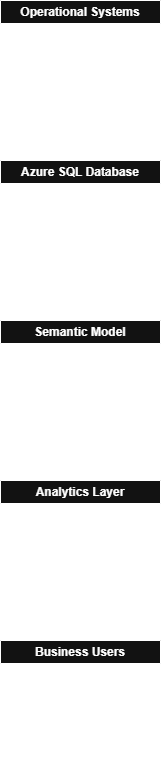

# Data Architecture

## Enterprise Analytics Platform Architecture

This architecture integrates multiple operational systems into a centralized analytics platform used for commercial and logistics analytics.

### Data Sources
- SAP HANA
- Mobiliza
- MySQL

### Data Storage
- Azure SQL Database used as the central analytical repository.

### Semantic Layer
- **HygeiaMS semantic model**
- Standardized KPIs built using **DAX**

### Analytics Layer
- Power BI dashboards
- Excel analytical reports connected to the semantic model

### Business Users
- Commercial
- Sales
- Logistics
- Management
