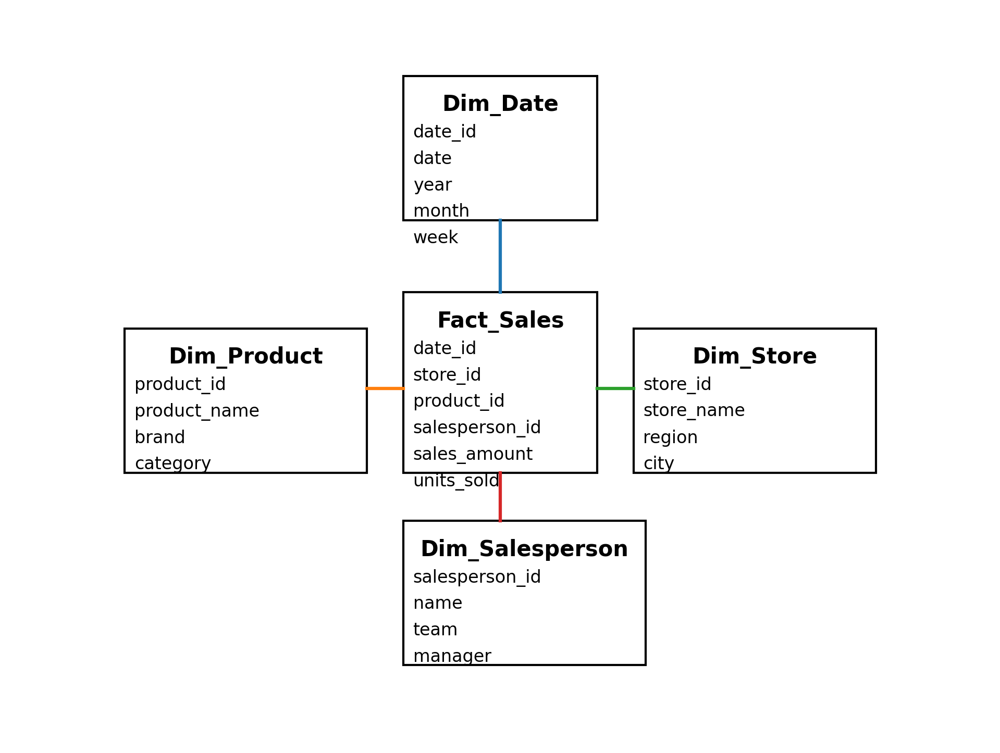

# Semantic Model

The analytics platform uses a centralized semantic model called **HygeiaMS** to standardize business metrics and ensure consistent reporting.

## Model Characteristics

- Integration of multiple operational data sources
- Centralized business dimensions
- Standardized KPIs using DAX
- Optimized structure for analytical reporting

## Main Entities

Examples of core entities included in the model:

- Sales
- Inventory
- Purchases
- Transfers
- Stores
- Products

## Semantic Model Diagram

